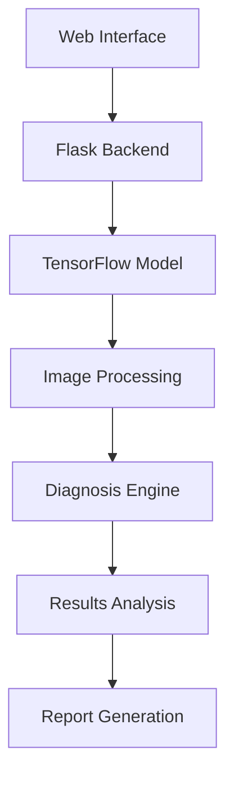

<div align="center">
  <h1>🔬 Intelligent Skin Disease Prediction System</h1>
  <p>Advanced AI-powered dermatological analysis platform</p>

  [](LICENSE)
  [](https://www.python.org)
  [](https://tensorflow.org)
  [](https://www.docker.com/)
</div>

<p align="center">
  
</p>

## 🌟 Key Features

<div align="center">

| Feature | Description |
|---------|------------|
| 🤖 AI-Powered Analysis | State-of-the-art deep learning for accurate skin condition detection |
| 📊 Real-time Processing | Instant analysis with visual feedback and progress tracking |
| 📱 Responsive Design | Seamless experience across all devices and screen sizes |
| 🔒 Privacy Focused | Secure image handling and data protection |
| 📈 Detailed Analytics | Comprehensive reports with confidence scores and recommendations |
| 🌐 Multi-language Support | Available in multiple languages for global accessibility |

</div>

## 🏗️ Architecture



## 📂 Project Structure

<pre>
📦 intelligent-skin-disease-prediction
├── 🐳 docker/
│   ├── Dockerfile
│   └── docker-compose.yml
├── 🎯 src/
│   ├── 🌐 static/
│   │   ├── css/
│   │   ├── js/
│   │   ├── img/
│   │   └── models/
│   ├── 📑 templates/
│   │   ├── index.html
│   │   ├── result.html
│   │   └── components/
│   └── 🐍 app/
│       ├── __init__.py
│       ├── routes.py
│       ├── models.py
│       └── utils.py
├── 📝 docs/
│   ├── API.md
│   └── CONTRIBUTING.md
├── 🧪 tests/
├── 📄 requirements.txt
└── 🚀 README.md
</pre>

## 🚀 Quick Start

### 🐍 Standard Installation

```bash
# Clone repository
git clone https://github.com/Awrsha/Intelligent-Skin-Disease-Prediction-System.git
cd Intelligent-Skin-Disease-Prediction-System

# Create virtual environment
python -m venv venv
source venv/bin/activate  # Linux/Mac
.\venv\Scripts\activate  # Windows

# Install dependencies
pip install -r requirements.txt

# Run application
python app.py
```

### 🐳 Docker Installation

```bash
# Build and run with Docker Compose
docker-compose up --build -d

# View logs
docker-compose logs -f
```

## 💻 Usage Guide

<div align="center">
  <table>
    <tr>
      <td align="center"><br>1. Upload Image</td>
      <td align="center"><br>2. Analysis</td>
      <td align="center"><br>3. Results</td>
    </tr>
  </table>
</div>

## 📊 Performance Metrics

<div align="center">

| Metric | Value |
|--------|--------|
| Accuracy | 83% |
| Precision | 82.2% |
| Recall | 85.7% |
| F1 Score | ?% |

</div>

## 🛡️ Security Features

- 🔒 SSL/TLS Encryption
- 🔐 JWT Authentication
- 🛡️ Rate Limiting
- 🔍 Input Validation
- 📝 Audit Logging

## 🤝 Contributing

We welcome contributions! Please see our [Contributing Guidelines](CONTRIBUTING.md) for details.

## 📄 License

This project is licensed under the MIT License - see the [LICENSE](LICENSE) file for details.

## 🙏 Acknowledgments

- Medical professionals who provided expert guidance
- Open-source community for various tools and libraries
- Research papers and datasets that made this possible

<div align="center">
  <h2>✨ Star History</h2>
  
</div>
