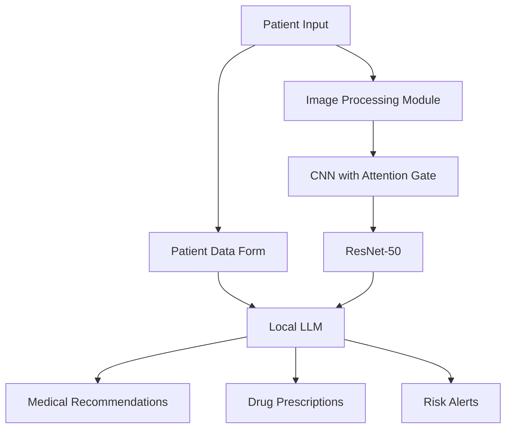

# 🏥 Smart Dermatological Analysis & Prescription System (SDAPS)

A powerful AI-driven system combining computer vision and natural language processing for dermatological diagnosis and personalized medical recommendations.

## 🎯 Performance Metrics

| Metric | Score |
|--------|-------|
| Sensitivity | 88% |
| Specificity | 84% |
| F1 Score | 81% |
| Accuracy | 87% |

## 🔍 System Architecture



## 🧠 Core Components

### 1. Computer Vision Module
- **Architecture**: CNN with Attention Gate + ResNet-50
- **Training Datasets**: 
  - ISIC (German Medical Research Center)
  - Melanoma Dataset (University of Waterloo)
- **Capabilities**: 
  - Lesion classification
  - Severity assessment (%)
  - Malignancy prediction

### 2. Medical Advisory System
- **Technology**: Local LLM ChatBot
- **Framework**: Flask
- **Frontend**: HTML, CSS, JavaScript, AJAX
- **UI Frameworks**: Bootstrap, TailWind
- **Features**:
  - Patient form analysis
  - ICommon and non-sanctioned drugs in Iran
  - Age-appropriate recommendations
  - Medical history consideration
  - Contraindication warnings

## 💡 Key Features

- 🔄 Real-time analysis
- 📊 Severity percentage estimation
- 💊 Personalized drug recommendations
- ⚠️ Risk assessment
- 📝 Comprehensive medical reports
- 🏷️ Multi-class lesion classification

## 🎯 Use Cases

1. **Remote Diagnosis**
   - Preliminary skin condition assessment
   - Severity estimation
   - Urgency determination

2. **Medical Recommendations**
   - Personalized treatment plans
   - Drug prescriptions
   - Dietary advice

3. **Risk Management**
   - Malignancy detection
   - Referral recommendations
   - Drug interaction warnings

## ⚙️ Technical Requirements

```yaml
Dependencies:
  - Python 3.8+
  - TensorFlow 2.x
  - Keras
  - Flask
  - OpenCV
  - CUDA Support

Hardware:
  - GPU: NVIDIA (8GB+ VRAM)
  - RAM: 16GB+
  - Storage: 500GB+
```

## 📈 Performance Visualization

```
Accuracy Distribution:
█████████████████████████████████████████ 87%
                                                     
Sensitivity vs Specificity:
Sensitivity: ████████████████████████████████████ 88%
Specificity: ██████████████████████████████████ 84%
                                                     
F1 Score:
████████████████████████████████████ 81%
```
